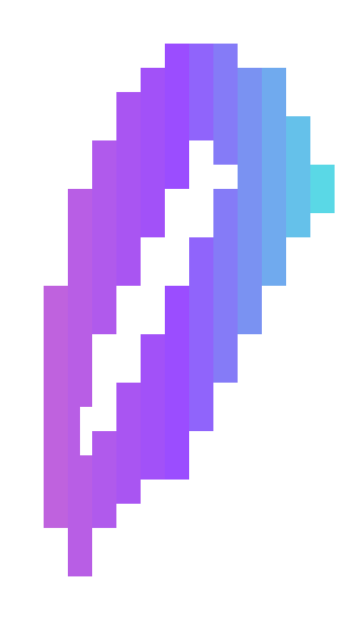
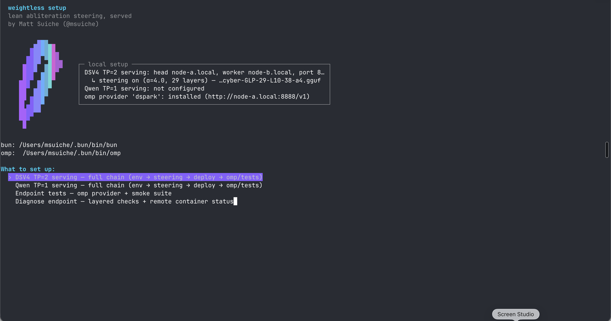
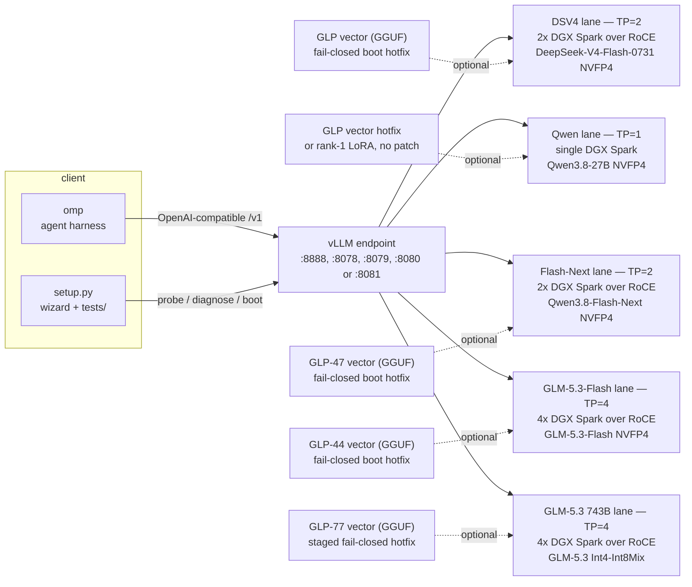
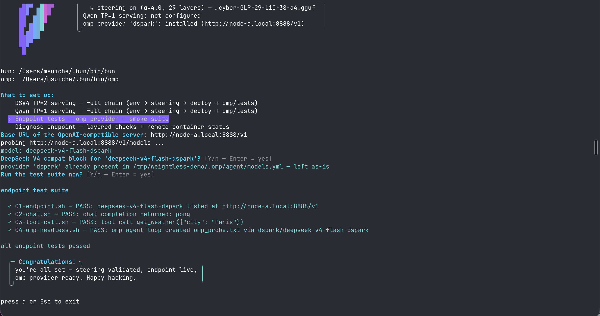

<p align="center">
  
</p>

# weightless

**Abliteration without the weights — put your model on GLP.** Projective
refusal steering for open-weight models: serving config, boot hotfixes, the
steering patch, and the GLP (GGUF Layer Projection) format spec. The goal is
most good open models; the lanes are DeepSeek V4 Flash 0731 on 2x
DGX Spark (GB10, SM121, TP=2 over RoCE), Qwen3.8-27B on a single Spark,
Qwen3.8-Flash-Next NVFP4 on 2x DGX Spark (TP=2, day-0 image), and
GLM-5.3-Flash NVFP4 on 4x DGX Spark (TP=4, patched day-0 image), and
GLM-5.3 743B Int4-Int8Mix on 4x DGX Spark (TP=4, tonyd2wild's recipe).
The method and the measurements behind it are in the original write-up:
[Abliteration without redistributing the model](https://www.msuiche.com/posts/autoresearch-abliteration-without-redistributing-the-model/).

The live DSV4 stack is the Anemll image (`ghcr.io/anemll/dspark-vllm-gx10:0.1.1`,
vLLM 0.25.2) driven by the MiaAI 2x recipe, with our state on top vendored in
`recipe/anemll/`; the Qwen lane (stock vLLM 0.27 image, GGUF or LoRA steering)
lives in `recipe/qwen/`; the Qwen3.8-Flash-Next lane (day-0 image
`vllm/vllm-openai:qwen38-flash-next`, GLP-47) lives in `recipe/qwen38fn/`;
the GLM-5.3-Flash lane (tonyd2wild's sm121-v8 patch stack on the day-0
`vllm/vllm-openai:glm53-flash-arm64-cu130`, GLP-44)
lives in `recipe/glm53/`; the GLM-5.3 743B lane (tonyd2wild's Int4-Int8Mix
stack, GLP-77) lives in `recipe/glm53xl/`. The
retired v027 stack's patch is kept for reference and as the fallback path.



## Quick start

```sh
python3 setup.py   # Python 3.9+, stdlib only — TUI wizard with a prompt fallback
```

Pick a lane and it walks the full chain: site values → env file → steering
validation → confirm-gated ssh deploy → omp provider (registered in omp's
modelRoles — default role, or every text role) + endpoint smoke tests.
Endpoint down? The diagnose chain isolates DNS → TCP → HTTP and can check and
boot the stack over ssh. Non-interactive alternative:
`sh tests/install.sh && sh tests/run.sh` with `DSPARK_*` env overrides.

## What this is: lean abliteration steering as a patch

The model weights are never redistributed — what this repo ships is the
*intervention*, tested and self-contained:

- **The steering file.** A GLP vector — a spec-conformant control-vector
  GGUF ([`spec/GLP.md`](spec/GLP.md)) with per-layer
  directions, derived by us and published under
  [`msuiche/`](https://huggingface.co/msuiche) (see
  [Steering artifacts](#steering-artifacts-ours)). No model weights inside.
- **The patch.** A fail-closed boot hotfix per lane
  (`patches/hotfix-*.py`) that loads the GLP file and installs the
  projective hook — no image build, no forked runtime. Structural guard
  tests in `scripts/`, hardware-validated numbers in each lane's README.
- **Quant-friendly.** The hook steers the residual stream at runtime, so it
  works on quantized checkpoints (NVFP4 verified on both lanes,
  bf16→NVFP4 transfer measured) as long as the base architecture is intact.
  The one exception is REAP-pruned builds: deleting experts changes the
  shape of the base model, the vector no longer matches the circuit, and
  the lane is rejected on those grounds (see [Lanes](#lanes)).
- **A no-patch option for Qwen.** The same intervention folded into a
  rank-1 LoRA we reproduced — it loads in stock vLLM/peft with no hotfix at
  all and matches the GGUF arm on hardware (both 24/32 refusal32).

Internals write-up:
[Abliteration without redistributing the model](https://www.msuiche.com/posts/autoresearch-abliteration-without-redistributing-the-model/).

## The stack

Serving is **vLLM** (the only runtime with working sm_121a NVFP4 + MTP paths
for these checkpoints on GB10), driven by **[omp](https://omp.sh/)** as the
agent harness/client — we picked it over stock Pi for the benchmaxxed tool
loop (hash-anchored edits, LSP/DAP wired in, fast headless mode), and this
repo's `tests/` suite proves the served model can drive it end to end.
Steering is optional per lane and off by default when the steer path is
empty:



The lanes never run at once: each multi-node lane (DSV4 on 2, Flash-Next on
2, the GLM lanes on 4) already holds its Sparks' GPUs, and the Qwen lane is
parked until the multi-node stack is down.



## Lanes

| lane | hardware | model | steering | status |
|---|---|---|---|---|
| **DSV4 TP=2** | both Sparks over dual-rail RoCE | DeepSeek-V4-Flash-0731, NVFP4 (166.9 GB) | projective cvec, live on 29 layers | **live** — `recipe/anemll/` |
| **Qwen TP=1** | one Spark | Qwen3.8-27B-NVFP4 (~13.5 GB) | per-layer cvec, L10–58 at α=1.0 ([shipping artifact](https://huggingface.co/msuiche/Qwen3.8-27B-abliterated-cyber-GLP-49)) | **hardware-validated** — `recipe/qwen/`; stock 4/32, GGUF 24/32, LoRA 24/32 on refusal32 (2026-08-22) |
| **Qwen3.8-Flash-Next TP=2** | both Sparks over RoCE | Qwen3.8-Flash-Next-NVFP4 (~135 GB), day-0 image | per-layer cvec, L1–47 at α=1.0 ([GLP-47](https://huggingface.co/msuiche/Qwen3.8-Flash-Next-abliterated-cyber-GLP-47)) | **hardware-validated 2026-09-01 (2x DGX Spark, GB10)** — `recipe/qwen38fn/`; steered live on the pair: refusal32 22/32 (stock 1/32), KV pool 35.3 GiB @ 262K native ctx; earlier cloud validation (2xB200): refusal32 1/32 → 26/32, benign 32/32; vector eval 81.2% refusal32 (vLLM lane, cos 0.9931 vs HF) |
| **DSV4-Vision-Exp** (Modal lane) | 4×H100 (tolmo) | DeepSeek-V4-Flash-Vision-Exp, FP8 (~168 GB) | per-layer cvec, L10–38 at α=1.0 ([GLP-29 Vision-Exp](https://huggingface.co/msuiche/DeepSeek-V4-Flash-Vision-Exp-abliterated-cyber-GLP-29)) | **vector-validated 2026-09-01** — refusal32 1/32 → 27/32 fresh (α=4 garbles — dose cliff), benign32 32/32 both arms; the 0731 GLP-29 keysdir vector transfers at 31/32 despite cos −0.32 (multi-directional refusal); no Spark recipe yet |
| **DSV4-Vision-Exp NVFP4** | 2×B200 (tolmo) | [msuiche/DeepSeek-V4-Flash-Vision-Exp-NVFP4](https://huggingface.co/msuiche/DeepSeek-V4-Flash-Vision-Exp-NVFP4) (176.5 GB, modelopt W4A4, experts-only) | same GLP-29 vectors | **boot-validated 2026-09-03 (stock vLLM 0.28.0, first vLLM boot of vision-exp)** — lossless MXFP4→NVFP4 transcode (byte-exact vs NVIDIA's recipe); NVFP4 ≈ FP8 ±1 item on refusal32, benign 32/32, capability 12/12, zero garbles; **steered-delivery delta vs the old HF-lane numbers is a lane effect (fp8 KV + kernels), not the quant** — FP8 control lands the same; `strip_vision.py` in-repo for stock-vLLM text boot; GB10 via modelopt_gb10_hybrid plugin |
| **Inkling-Small** (Modal lane) | 4×H100 (tolmo) | Inkling-Small-NVFP4 (159 GiB), stock vLLM 0.28.0 | per-layer cvec, L1–41 at **α=0.25** ([GLP-41](https://huggingface.co/msuiche/Inkling-Small-abliterated-cyber-GLP-41)) | **vector-validated 2026-09-02** — refusal32 0/32 stock (total lockdown) → 30/32 steered, benign32 30/32; **α=1.0 garbles everything — the most dose-sensitive model in the program** (calibrated dose = ¼ of Qwen's); first GLP for a Thinking Machines model; **DGX Spark TP=2 lane BLOCKED 2026-09-03 — engine bug, see `recipe/inkling/README.md` STATUS** |
| **Hy4-preview** (Modal lane) | 8×H200 (tolmo) | tencent/Hy4-preview-FP8 (770B / 49B active, ~770 GB), day-0 image | per-layer cvec, L1–77 at **α=2.0** ([GLP-77 Hy4](https://huggingface.co/msuiche/Hy4-preview-abliterated-cyber-GLP-77-L1-77-a2.0)) | **vector-validated 2026-09-02** — refusal32 1/32 → **24/32**, cyber32 15/32 → **31/32**, benign32 **32/32 at α=2.0** (collateral non-monotonic: worst at α=1.0–1.5, zero at full dose); no garble at any dose — most steer-tolerant arch in the program; **largest model with a published refusal vector**; caveat: refusal32 answers all run to the 4K cap at α=2.0 |
| **GLM-5.3-Flash TP=4** | **four** Sparks over RoCE | GLM-5.3-Flash-NVFP4 (~50 GiB/rank), sm121-v8 patched day-0 image | per-layer cvec, L1–44 at α=2.0 ([GLP-44](https://huggingface.co/msuiche/GLM-5.3-Flash-abliterated-cyber-GLP-44)) | **hardware-validated stack** — `recipe/glm53/`; 1M context (3.77M-token fp8 KV pool), 36 tok/s freeform → 53–64 tok/s structured/agentic with DFlash2 spec decode (acceptance is regime-dependent; steering costs none — measured, see below); vector eval 65.6% refusal32 at α=2.0; **α≥2.5 garbles this model** |
| **GLM-5.3 743B TP=4** | **four** Sparks over RoCE | GLM-5.3 Int4-Int8Mix (~95.5 GiB/rank), tonyd2wild's stack (local image + sm12x overlay) | per-layer cvec, L1–77 at α=1.0 ([GLP-77](https://huggingface.co/msuiche/GLM-5.3-abliterated-cyber-GLP-77)) | **hotfix live-validated 2026-08-30** — `recipe/glm53xl/`; on stock vLLM 0.28.0 (8×H100, RadixArk/GLM-5.3-NVFP4): refusal32 1→10/32, cyber32 15→31/32; **the 4x-Spark GB10 lane itself remains untested** (needs the hardware); vector eval (8×H100, full-length): cyber32 32/32, refusal32 12/32 (37.5%; 6/32 answer-audited) at α=1.0, null arm = stock; **refusal on the 753B is much stickier than Flash — α>1 makes it WORSE** |

**GLM-5.3-Flash needs 4 nodes — and a patched image.** At TP4 the NVFP4
quant is ~50 GiB of weights per 128 GB node, which is what makes the
1M-context KV pool possible. A 2-node TP2 config exists (262K context,
KV-starved — [tonyd2wild's TP2 repo](https://github.com/tonyd2wild/GLM-5.3-Flash-NVFP4-262K-2x-DGX-Spark))
but stays out of scope for this wizard lane. The stock day-0 vendor image
dies five different ways on GB10; the lane requires the sm121-v8 patch stack
(`radixark/vllm-glm53-flash:sm121-v8` or a local v1→v8 build — details in
`recipe/glm53/README.md`). If your `machines.txt` lists two nodes, this lane
cannot boot until two more are racked and cabled. The 743B lane needs the
same four nodes plus tonyd2wild's Int4-Int8Mix weights (377.4 GiB) and stack
(image + kernel overlay — `recipe/glm53xl/README.md`); its first real boot is
the anchor test (the hotfix stages fail-closed before GPU time). On x86
SM120 instead of Sparks, brandonmusic's EXL3/B12X build
(`brandonmusic/GLM-5.3-Flash-tr3-4bpw`, custom vLLM fork) takes the same
GLP-44 hotfix mechanics — see `recipe/glm53/README.md` (runtime-validated
on 2x RTX PRO 6000: refusal32 1→15/32, cyber32 14→31/32).

**DFlash2 spec decode and steering — measured, not assumed** (2026-08-30,
4xH100, Prometheus spec_decode counters): GLP-44 steering at α=2.0 costs the
drafter **no acceptance** — structured 81.4% → 87.1% steered, prose 26.1% →
24.4% — because the drafter's aux-capture taps sit *before* the steering
injection point and condition on pre-steering features. The stock tap set
`[5,14,24,33,42]` ships in the drafter's own config.json and is
training-matched: a 7-set sweep found every alternative worse, tapping the
final target layer poisons the drafter (~6% acceptance), and the tap count
is fixed by the checkpoint's fc width. Prose acceptance (~26% Flash, ~23%
flagship) is a drafter-capacity limit, not a tap-tuning opportunity — do not
retune the taps.

**Single-Spark DSV4 (EXL3 3.0bpw + REAP-K216): evaluated and rejected.**
The full NVFP4 checkpoint (166.9 GB) cannot fit one Spark, so single-node
DSV4 exists only as the pruned/quantized artifact — REAP deletes 40 of 256
routed experts per MoE layer on top of the 3.0bpw quant. Benchmarks pass,
but the degradation concentrates in rare behaviour by construction, and the
control vector would need re-deriving on the pruned circuit. TP=1 DSV4 is a
smaller, approximated model; we do not serve it. The steering *contract* in
`spec/GLP.md` remains lane-independent.

## Layout

| path | what it is |
|---|---|
| `setup.py` | full-chain setup wizard (TUI or prompts, stdlib-only): lane pick → env file → steering validation → ssh deploy → omp provider + tests, plus a diagnose chain (DNS → TCP → HTTP → remote docker/GPU status, optional boot) |
| `recipe/anemll/` | **live**: compose / start script / `.env.dsv4.example` for the MiaAI 2x clone, plus rebuild notes |
| `recipe/qwen/` | Qwen TP=1 lane: serve script + `.env.qwen.example`; `STEER_MODE=gguf\|lora`, both hardware-validated |
| `recipe/qwen38fn/` | Qwen3.8-Flash-Next TP=2 lane: head+worker start script + `.env.qwen38fn.example`; `--no-enable-prefix-caching` and `VLLM_PLE_CPU_OFFLOAD=1` are mandatory there |
| `recipe/glm53/` | GLM-5.3-Flash TP=4 lane: head+3-worker start script + `.env.glm53.example`; needs 4 nodes and the sm121-v8 patched image, α=2.0 is calibrated (α≥2.5 garbles) |
| `recipe/glm53xl/` | GLM-5.3 743B TP=4 lane: head+3-worker start script + `.env.glm53xl.example`; needs 4 nodes + tonyd2wild's Int4-Int8Mix weights/stack, α=1.0 is calibrated (higher makes refusal worse) |
| `patches/hotfix-dsv4-steering-projective.py` | **live**: steering as a fail-closed boot hotfix for the 0.25.2 image (embedded GGUF reader) |
| `patches/hotfix-qwen38-steering-projective.py` | the same steering for the Qwen lane: patches `qwen3_next.py` + `qwen3_5.py`, steers `hidden_states + residual` |
| `patches/hotfix-qwen38fn-steering-projective.py` | the same steering for the Flash-Next lane: patches the day-0 image's `vllm/models/qwen3_8_flash_next/nvidia/model.py`, steers the materialized hyper-connection stream (10240 = 4×2560) |
| `patches/hotfix-glm53-steering-projective.py` | the same steering for the GLM-5.3 lane: patches `vllm/models/glm5next/nvidia/model.py`, steers the materialized mHC stream (16384 = 4×4096); the last layer's in-decoder contract is deferred so L44 is covered |
| `patches/hotfix-glm53xl-steering-projective.py` | the same steering for the GLM-5.3 743B lane: patches the overlay's `deepseek_v2.py` copy at staging (the mount is read-only), steers `hidden_states + residual` (decomposed convention, no HC widening) |
| `patches/hotfix-glm53-exl3-steering-projective.py` | the GLM-5.3-Flash steering for brandonmusic's EXL3/B12X fork image (SM120): the fork's DFlash branch splits the decoder loop in two — the variant patches both (aux loop steers after the aux capture, pre-steer features) |
| `patches/vendor/sparse_attn_indexer_kpool_sm121.py` | vendored SM121 indexer top-k fix (tonyd2wild's DFlash2 repo, provenance header inside): bind-mounted over the in-image file on every glm53 node — without it both published images hard-kill on decode past ~24K context |
| `patches/reference/glm5next_b12x_exl3.py` | the EXL3 structure test's reference — the model file extracted from the published `verdictai/glm53-flash-exl3-k4` image (OCI layer sha256:7f03081e…) |
| `patches/reference/deepseek_v2_glm53xl.py` | the 743B structure test's reference — tonyd2wild's kernel-overlay `deepseek_v2.py` (the file his stack actually serves); same anchors as vLLM v0.28.0 |
| `patches/reference/qwen3_8_flash_next.py` | byte-identical copy of the day-0 image's model file — the Flash-Next structure test's reference (the `../vllm` checkout predates the arch) |
| `patches/reference/glm5next.py` | the GLM-5.3 structure test's reference — from the day-0 PR source (vllm-project/vllm#53906); re-vendor against the image on first deploy |
| `patches/0001-*.patch`, `0002-*.patch` | the hook + its vLLM-side test as git patches against v0.27.0 (fallback stack) |
| `recipe/` (top level) | retired v027 stack: Dockerfiles + compose |
| `scripts/` | structural guard tests for the steering patches: `test-dsv4-hotfix-structure.py`, `test-qwen-steering-structure.py`, `test-qwen38fn-steering-structure.py`, `test-glm53-steering-structure.py`, `test-glm53xl-steering-structure.py`, `test-glm53-exl3-steering-structure.py`, `test-steering-structure.py` (retired v027 overlay) |
| `tests/` | endpoint smoke tests: endpoint / chat / tool-call / headless omp agent loop — `tests/README.md` |
| `spec/GLP.md` | the GLP format spec: the `glp.mode` contract, layer-id mapping, why an additive reader must refuse the file |
| `BENCHMARK.md` | steering effectiveness (all GLP vectors, all suites, with domain coverage) + the serving run log |

Real `.env` files are gitignored — only `*.example` templates are tracked.

## Steering (live stack)

Off unless `WEIGHTLESS_STEER_PATH` is set. The env vars pass through
`recipe/anemll/docker-compose.dsv4.yml` and the GGUF reader is embedded in
the hotfix — nothing to build:

```sh
# the general/broad direction; the cyber-derived alternative
# (...-abliterated-cyber-GLP-29-L10-38-a4.gguf) is a one-line swap
WEIGHTLESS_STEER_PATH=/cache/huggingface/DeepSeek-V4-Flash-0731-general-abliterated-cvec-L10-38-a4-keysdir.gguf
WEIGHTLESS_STEER_ALPHA=4.0
WEIGHTLESS_STEER_LAYERS=$(seq -s, 10 38)
```

Confirm from the boot log — **check that `layers=` reads 29, not 1**:

```
weightless GLP steering active: hook=post_layer alpha=4.000 ... layers=29 [10, ...]
```

A previous revision dedented the per-layer assignment out of its loop and
steered one layer while reporting 29; coverage dominates this intervention
(6 layers leaves 18.0% refusal, 29 leaves 0.0%). The structural tests in
`scripts/` guard that regression.

`alpha` is not a strength dial. At 1 the component is removed; past 1 it is
reflected, which installs the behaviour rather than removing it. To run
weaker, subset the layers and leave alpha alone. The 4.0 above is calibrated
for this checkpoint; do not carry it to another model.

## Steering artifacts (ours)

Naming convention: **GLP-n** is a GLP vector touching **n layers** — GLP-29
below is the DSV4 vector, GLP-49 the Qwen one, GLP-47 the Flash-Next one,
GLP-44 the GLM-Flash one, GLP-77 the GLM 743B one. All five lanes' vectors are
published under `msuiche/` on Hugging Face (gated — fetch with an HF token),
spec-conformant per [`spec/GLP.md`](spec/GLP.md) and
verified against their pinned checkpoint revisions.

- [`msuiche/DeepSeek-V4-Flash-0731-abliterated-cyber-GLP-29`](https://huggingface.co/msuiche/DeepSeek-V4-Flash-0731-abliterated-cyber-GLP-29)
  — **DSV4 lane, GLP-29 (GGUF).** Cyber-contrast vector: 29 per-layer
  directions over
  L10–38, n_embd 4096, α=4.0. The live config currently serves the
  general-contrast variant from the same repo family — a *third-party*
  direction we reformatted, re-measured and repackaged (attribution in the
  file metadata); swapping is one `WEIGHTLESS_STEER_PATH` line. Wiring:
  `recipe/anemll/README.md`.
- [`msuiche/Qwen3.8-27B-abliterated-cyber-GLP-49`](https://huggingface.co/msuiche/Qwen3.8-27B-abliterated-cyber-GLP-49)
  — **Qwen lane, GLP-49 (GGUF + LoRA).** The GGUF is canonical: per-layer
  diff of
  means, 49 directions over L10–58, n_embd 5120, α=1.0 (α=4 measurably
  over-refuses on this model). The rank-1 LoRA (`mlp.down_proj`, L1–63,
  α=1.0 baked) is the same intervention folded into weights — it loads in
  stock vLLM/peft/llama.cpp with no hotfix, matches the GGUF on NVFP4
  hardware (both 24/32 refusal32, 2026-08-22), but is still unscored on the
  cyber holdout and is valid only for checkpoint revision `1d4bf0f2ff60`
  (`lora_A` embeds `W`). Wiring: `recipe/qwen/README.md`.
- [`msuiche/Qwen3.8-Flash-Next-abliterated-cyber-GLP-47`](https://huggingface.co/msuiche/Qwen3.8-Flash-Next-abliterated-cyber-GLP-47)
  — **Qwen3.8-Flash-Next (`qwen4_exp`), GLP-47, day-0.** Per-layer
  difference-of-means over the widened hyper-connection stream (10240 =
  4×2560), layers 1–47, α=1.0. Derived 2026-08-26 on Modal (8×H100, BF16
  reference) from AdvBench-vs-Alpaca. refusal32 3.1% → 81.2% at α=1.0 with
  benign32 32/32 and capability12 12/12 (higher α over-projects — do not
  raise it; the shipped default is the measured peak). Direction verified
  engine-independent: a vLLM-lane capture reproduces it at cos 0.9931.
  Serving lane: `recipe/qwen38fn/` (TP=2 on 2x Spark, day-0 image; the
  hotfix steers the materialized hyper-connection stream).
- [`msuiche/GLM-5.3-Flash-abliterated-cyber-GLP-44`](https://huggingface.co/msuiche/GLM-5.3-Flash-abliterated-cyber-GLP-44)
  — **GLM-5.3-Flash (`glm5_next`), GLP-44, day-0.** Per-layer dom over the
  Sinkhorn hyper-connection stream (16384 = 4×4096), layers 1–44, α=2.0.
  Derived from the FP8-native canonical checkpoint (snapshot `3f1971b7`).
  refusal32 3.1% → 65.6% at α=2.0, benign/capability clean; **α=2.5+
  garbles everything** — the cliff is abrupt, stay at or below 2.0.
  Serving lane: `recipe/glm53/` (TP=4 on **4x Spark**, NVFP4 quant on the
  sm121-v8 patched day-0 image; the hotfix steers the materialized mHC
  stream).
- [`msuiche/GLM-5.3-abliterated-cyber-GLP-77`](https://huggingface.co/msuiche/GLM-5.3-abliterated-cyber-GLP-77)
  — **GLM-5.3 743B (`glm_moe_dsa`), GLP-77.** Per-layer dom over the plain
  residual stream (6144 — no hyperconnection widening on this arch), layers
  1–77, α=1.0. Derived 2026-08-30 on the NVFP4 deployment (8×H100, vLLM
  0.28.0) with the vLLM capture lane; every shipped layer clears the null
  gate. cyber32 18/32 → **32/32** at α=1.0 with benign/capability clean and a
  passing null arm; refusal32 moves 1/32 → 12/32 (37.5%; 6/32 answer-audited)
  — the 753B flagship's refusal is much stickier than Flash's, and **α>1
  makes it WORSE at full length** (do not raise it). Serving lane:
  `recipe/glm53xl/` (TP=4 on 4x Spark, tonyd2wild's Int4-Int8Mix stack; the
  hotfix steers `hidden_states + residual` on the `deepseek_v2` path).

## Roadmap

- **More model lanes.** The GLP spec and the fail-closed hotfix pattern are
  model-agnostic — DSV4 and Qwen3.8 are the starting lanes, not the scope.
  The target is most good open models, one `recipe/` lane and one published
  GLP vector each. Day-0 vectors for Qwen3.8-Flash-Next (GLP-47) and
  GLM-5.3-Flash (GLP-44) shipped 2026-08-27, GLM-5.3 743B (GLP-77) 2026-08-30;
  their serving lanes are `recipe/qwen38fn/` (TP=2), `recipe/glm53/` (TP=4,
  needs 4 nodes) and `recipe/glm53xl/` (TP=4, 4 nodes + the Int4-Int8Mix
  stack).
- **k=7/greedy draft A/B** (upstream issue #84): now one env line
  (`DRAFT_SAMPLE_METHOD=greedy MTP_NUM_TOKENS=7`) after the 2026-08-21
  upstream merge.
- **Qwen LoRA cyber-holdout score** (run L): both Qwen steering arms match
  on refusal32; the LoRA arm still needs its cyber-holdout number before it
  can replace GGUF as the default. Lives in the eval pipeline, not this repo.

## References & credits

- [Abliteration without redistributing the model](https://www.msuiche.com/posts/autoresearch-abliteration-without-redistributing-the-model/) — our write-up of the steering internals (the method this repo packages)
- [deepseek-ai/DeepSeek-V4-Flash-0731](https://huggingface.co/deepseek-ai/DeepSeek-V4-Flash-0731) — the model (MIT)
- [tonyd2wild/DeepSeek-v4-Flash-0731-DSpark-1M-NVFP4-KV-2x-DGX-Spark](https://github.com/tonyd2wild/DeepSeek-v4-Flash-0731-DSpark-1M-NVFP4-KV-2x-DGX-Spark) — the original 2x DSpark NVFP4-KV recipe; its issue #18 is the spec-decode corruption we root-caused before migrating
- [MiaAI-Lab/DeepSeek-v4-Flash-DSpark-2x-DGX-Spark](https://github.com/MiaAI-Lab/DeepSeek-v4-Flash-DSpark-2x-DGX-Spark) — the 2-node recipe we run (our state vendored in `recipe/anemll/`)
- [MiaAI-Lab/DeepSeek-v4-Flash-One-DGX-Spark](https://github.com/MiaAI-Lab/DeepSeek-v4-Flash-One-DGX-Spark) — single-Spark EXL3/REAP sibling (lane rejected — REAP pruning degrades the tail)
- [Anemll's GX10 image](https://github.com/anemll) (`ghcr.io/anemll/dspark-vllm-gx10`) — the vLLM 0.25.2 runtime
- [local-inference-lab/b12x](https://github.com/local-inference-lab/b12x) — the sparkinfer/b12x kernel stack inside the image
- [0xSero/deepseek-v4-flash-0731-spark](https://huggingface.co/0xSero/deepseek-v4-flash-0731-spark) — the single-Spark EXL3/REAP build (evaluated, rejected — see Lanes)
- [Loke-60000/deepseek-v4-flash-0731-spark-vision](https://huggingface.co/Loke-60000/deepseek-v4-flash-0731-spark-vision) — community Spark vision serving fix (surveyed, not adopted)
- [drowzeys/keys-DeepSeekV4-Flash-GA-0731-Dspark-Abliterated-32-32](https://huggingface.co/drowzeys/keys-DeepSeekV4-Flash-GA-0731-Dspark-Abliterated-32-32) — Keys' abliterated DSV4 checkpoint, prior art; the benchmarked general/broad direction (`keysdir` artifact) was recovered from these weights by SVD
- [orcarouter/Qwen3.8-27B-Uncensored-FP8](https://huggingface.co/orcarouter/Qwen3.8-27B-Uncensored-FP8) — the published Qwen3.8 abliteration we benchmark against; its direction, SVD-recovered and run through our harness, scores 90.6/100/100
- [drowzeys/keys-vLLm.0.27-Qwen3.8-NVFP4-MTP3-Single-DGX-Spark](https://github.com/drowzeys/keys-vLLm.0.27-Qwen3.8-NVFP4-MTP3-Single-DGX-Spark) — the Qwen TP=1 lane's serving recipe
- [tonyd2wild/GLM-5.3-Flash-NVFP4-1M-KV-4x-DGX-Spark](https://github.com/tonyd2wild/GLM-5.3-Flash-NVFP4-1M-KV-4x-DGX-Spark) + the [TP2 companion](https://github.com/tonyd2wild/GLM-5.3-Flash-NVFP4-262K-2x-DGX-Spark) — the GLM-5.3 lane's serving stack (sm121-v8 image patches, boot ritual, KV ladder), deployed and debugged by Knox (Claude) for @tonyd2wild; quant by [LibertAIDAI](https://huggingface.co/LibertAIDAI/GLM-5.3-Flash-NVFP4); gmu reference config by barrydeen
- [tonyd2wild/GLM-5.3-Int4-Int8Mix-TP4-4x-DGX-Spark](https://github.com/tonyd2wild/GLM-5.3-Int4-Int8Mix-TP4-4x-DGX-Spark) + the [GLM-5.3 DGX Spark Cookbook](https://github.com/tonyd2wild/GLM-5.3-DGX-Spark-Cookbook) — the GLM-5.3 743B lane's serving stack (Int4-Int8Mix quant, sm12x kernel overlay, boot ritual); quant recipe from [QuantTrio](https://huggingface.co/QuantTrio), weights at [2wild4tv/GLM-5.3-Int4-Int8Mix](https://huggingface.co/2wild4tv/GLM-5.3-Int4-Int8Mix)

## Fallback: the retired v027 stack

Parked, not deleted — the v0.27 git patch and its test remain under
`patches/`. Essentials if you ever revive it:

- Maintenance home is the `dspark-steering-v027` branch of
  [`msuiche/vllm`](https://github.com/msuiche/vllm), so upstream bumps get a
  real 3-way merge. Regenerate with:
  `git -C ../vllm diff v0.27.0..dspark-steering-v027 -- vllm/models/deepseek_v4/nvidia/model.py > patches/0001-dspark-projective-steering.patch`
- Apply without an image build: run the stock v027 image and bind-mount the
  patched `model.py` over the original. Resolve the in-image path first (it
  is `/opt/vllm-src/vllm`, a source install — bind-mounting a path that does
  not exist silently creates it and yields an inert patch; the `layers=29`
  boot line is the confirmation steering is live).
- Base image:
  `ghcr.io/bjk110/vllm-spark:v027-ngc2607-dsv4-0731-dspark-k7-256k-production`
  (registry is rate-limited for anonymous pulls — `docker login ghcr.io`
  first). It has **no `gguf` module**: build `recipe/Dockerfile.gguf-dep`
  and point `DSPARK_VLLM_IMAGE` at it. Never load a `.pt` instead — that
  goes through `torch.load` and bypasses every spec check in the reader.
- Settled v027 config: context **1,032,192** (1,048,576 collapses prefill to
  110 tok/s), KV `fp8_ds_mla`, spec decode `dspark` k=5, `max-num-seqs` 6.
  Measurements: `BENCHMARK.md` Runs 001–005.
