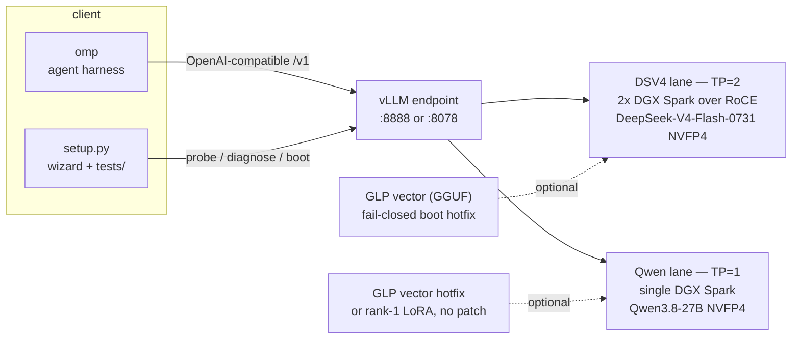

<p align="center">
  
</p>

# weightless

**Abliteration without the weights — put your model on GLP.** Projective
refusal steering for open-weight models: serving config, boot hotfixes, the
steering patch, and the GLP (GGUF Layer Projection) format spec. The goal is
most good open models; the first two lanes are DeepSeek V4 Flash 0731 on 2x
DGX Spark (GB10, SM121, TP=2 over RoCE) and Qwen3.8-27B on a single Spark.
The method and the measurements behind it are in the original write-up:
[Abliteration without redistributing the model](https://www.msuiche.com/posts/autoresearch-abliteration-without-redistributing-the-model/).

The live DSV4 stack is the Anemll image (`ghcr.io/anemll/dspark-vllm-gx10:0.1.1`,
vLLM 0.25.2) driven by the MiaAI 2x recipe, with our state on top vendored in
`recipe/anemll/`; the Qwen lane (stock vLLM 0.27 image, GGUF or LoRA steering)
lives in `recipe/qwen/`. The retired v027 stack's patch is kept for reference
and as the fallback path.


## Quick start

```sh
python3 setup.py   # Python 3.9+, stdlib only — TUI wizard with a prompt fallback
```

Pick a lane and it walks the full chain: site values → env file → steering
validation → confirm-gated ssh deploy → omp provider (registered as omp's
default model) + endpoint smoke tests.
Endpoint down? The diagnose chain isolates DNS → TCP → HTTP and can check and
boot the stack over ssh. Non-interactive alternative:
`sh tests/install.sh && sh tests/run.sh` with `DSPARK_*` env overrides.

## What this is: lean abliteration steering as a patch

The model weights are never redistributed — what this repo ships is the
*intervention*, tested and self-contained:

- **The steering file.** A GLP vector — a spec-conformant control-vector
  GGUF ([`spec/GLP.md`](spec/GLP.md)) with per-layer
  directions, derived by us and published under
  [`msuiche/`](https://huggingface.co/msuiche) (see
  [Steering artifacts](#steering-artifacts-ours)). No model weights inside.
- **The patch.** A fail-closed boot hotfix per lane
  (`patches/hotfix-*.py`) that loads the GLP file and installs the
  projective hook — no image build, no forked runtime. Structural guard
  tests in `scripts/`, hardware-validated numbers in each lane's README.
- **Quant-friendly.** The hook steers the residual stream at runtime, so it
  works on quantized checkpoints (NVFP4 verified on both lanes,
  bf16→NVFP4 transfer measured) as long as the base architecture is intact.
  The one exception is REAP-pruned builds: deleting experts changes the
  shape of the base model, the vector no longer matches the circuit, and
  the lane is rejected on those grounds (see [Lanes](#lanes)).
- **A no-patch option for Qwen.** The same intervention folded into a
  rank-1 LoRA we reproduced — it loads in stock vLLM/peft with no hotfix at
  all and matches the GGUF arm on hardware (both 24/32 refusal32).

Internals write-up:
[Abliteration without redistributing the model](https://www.msuiche.com/posts/autoresearch-abliteration-without-redistributing-the-model/).

## The stack

Serving is **vLLM** (the only runtime with working sm_121a NVFP4 + MTP paths
for these checkpoints on GB10), driven by **[omp](https://omp.sh/)** as the
agent harness/client — we picked it over stock Pi for the benchmaxxed tool
loop (hash-anchored edits, LSP/DAP wired in, fast headless mode), and this
repo's `tests/` suite proves the served model can drive it end to end.
Steering is optional per lane and off by default when the steer path is
empty:



The two lanes never run at once: DSV4 TP=2 already holds both GPUs at 0.80
memory utilization, so the Qwen lane is parked until DSV4 is down.


## Lanes

| lane | hardware | model | steering | status |
|---|---|---|---|---|
| **DSV4 TP=2** | both Sparks over dual-rail RoCE | DeepSeek-V4-Flash-0731, NVFP4 (166.9 GB) | projective cvec, live on 29 layers | **live** — `recipe/anemll/` |
| **Qwen TP=1** | one Spark | Qwen3.8-27B-NVFP4 (~13.5 GB) | per-layer cvec, L10–58 at α=1.0 ([shipping artifact](https://huggingface.co/msuiche/Qwen3.8-27B-abliterated-cyber-GLP-49)) | **hardware-validated** — `recipe/qwen/`; stock 4/32, GGUF 24/32, LoRA 24/32 on refusal32 (2026-08-22) |

**Single-Spark DSV4 (EXL3 3.0bpw + REAP-K216): evaluated and rejected.**
The full NVFP4 checkpoint (166.9 GB) cannot fit one Spark, so single-node
DSV4 exists only as the pruned/quantized artifact — REAP deletes 40 of 256
routed experts per MoE layer on top of the 3.0bpw quant. Benchmarks pass,
but the degradation concentrates in rare behaviour by construction, and the
control vector would need re-deriving on the pruned circuit. TP=1 DSV4 is a
smaller, approximated model; we do not serve it. The steering *contract* in
`spec/GLP.md` remains lane-independent.

## Layout

| path | what it is |
|---|---|
| `setup.py` | full-chain setup wizard (TUI or prompts, stdlib-only): lane pick → env file → steering validation → ssh deploy → omp provider + tests, plus a diagnose chain (DNS → TCP → HTTP → remote docker/GPU status, optional boot) |
| `recipe/anemll/` | **live**: compose / start script / `.env.dsv4.example` for the MiaAI 2x clone, plus rebuild notes |
| `recipe/qwen/` | Qwen TP=1 lane: serve script + `.env.qwen.example`; `STEER_MODE=gguf\|lora`, both hardware-validated |
| `patches/hotfix-dsv4-steering-projective.py` | **live**: steering as a fail-closed boot hotfix for the 0.25.2 image (embedded GGUF reader) |
| `patches/hotfix-qwen38-steering-projective.py` | the same steering for the Qwen lane: patches `qwen3_next.py` + `qwen3_5.py`, steers `hidden_states + residual` |
| `patches/0001-*.patch`, `0002-*.patch` | the hook + its vLLM-side test as git patches against v0.27.0 (fallback stack) |
| `recipe/` (top level) | retired v027 stack: Dockerfiles + compose |
| `scripts/` | structural guard tests for the steering patches: `test-dsv4-hotfix-structure.py`, `test-qwen-steering-structure.py`, `test-steering-structure.py` (retired v027 overlay) |
| `tests/` | endpoint smoke tests: endpoint / chat / tool-call / headless omp agent loop — `tests/README.md` |
| `spec/GLP.md` | the GLP format spec: the `glp.mode` contract, layer-id mapping, why an additive reader must refuse the file |
| `BENCHMARK.md` | every serving measurement, with shapes stated |

Real `.env` files are gitignored — only `*.example` templates are tracked.

## Steering (live stack)

Off unless `WEIGHTLESS_STEER_PATH` is set. The env vars pass through
`recipe/anemll/docker-compose.dsv4.yml` and the GGUF reader is embedded in
the hotfix — nothing to build:

```sh
# the general/broad direction; the cyber-derived alternative
# (...-abliterated-cyber-GLP-29-L10-38-a4.gguf) is a one-line swap
WEIGHTLESS_STEER_PATH=/cache/huggingface/DeepSeek-V4-Flash-0731-general-abliterated-cvec-L10-38-a4-keysdir.gguf
WEIGHTLESS_STEER_ALPHA=4.0
WEIGHTLESS_STEER_LAYERS=$(seq -s, 10 38)
```

Confirm from the boot log — **check that `layers=` reads 29, not 1**:

```
weightless GLP steering active: hook=post_layer alpha=4.000 ... layers=29 [10, ...]
```

A previous revision dedented the per-layer assignment out of its loop and
steered one layer while reporting 29; coverage dominates this intervention
(6 layers leaves 18.0% refusal, 29 leaves 0.0%). The structural tests in
`scripts/` guard that regression.

`alpha` is not a strength dial. At 1 the component is removed; past 1 it is
reflected, which installs the behaviour rather than removing it. To run
weaker, subset the layers and leave alpha alone. The 4.0 above is calibrated
for this checkpoint; do not carry it to another model.

## Steering artifacts (ours)

Naming convention: **GLP-n** is a GLP vector touching **n layers** — GLP-29
below is the DSV4 vector, GLP-49 the Qwen one. Both lanes' vectors are
published under `msuiche/` on Hugging Face (gated — fetch with an HF token),
spec-conformant per [`spec/GLP.md`](spec/GLP.md) and
verified against their pinned checkpoint revisions.

- [`msuiche/DeepSeek-V4-Flash-0731-abliterated-cyber-GLP-29`](https://huggingface.co/msuiche/DeepSeek-V4-Flash-0731-abliterated-cyber-GLP-29)
  — **DSV4 lane, GLP-29 (GGUF).** Cyber-contrast vector: 29 per-layer
  directions over
  L10–38, n_embd 4096, α=4.0. The live config currently serves the
  general-contrast variant from the same repo family — a *third-party*
  direction we reformatted, re-measured and repackaged (attribution in the
  file metadata); swapping is one `WEIGHTLESS_STEER_PATH` line. Wiring:
  `recipe/anemll/README.md`.
- [`msuiche/Qwen3.8-27B-abliterated-cyber-GLP-49`](https://huggingface.co/msuiche/Qwen3.8-27B-abliterated-cyber-GLP-49)
  — **Qwen lane, GLP-49 (GGUF + LoRA).** The GGUF is canonical: per-layer
  diff of
  means, 49 directions over L10–58, n_embd 5120, α=1.0 (α=4 measurably
  over-refuses on this model). The rank-1 LoRA (`mlp.down_proj`, L1–63,
  α=1.0 baked) is the same intervention folded into weights — it loads in
  stock vLLM/peft/llama.cpp with no hotfix, matches the GGUF on NVFP4
  hardware (both 24/32 refusal32, 2026-08-22), but is still unscored on the
  cyber holdout and is valid only for checkpoint revision `1d4bf0f2ff60`
  (`lora_A` embeds `W`). Wiring: `recipe/qwen/README.md`.

## Roadmap

- **More model lanes.** The GLP spec and the fail-closed hotfix pattern are
  model-agnostic — DSV4 and Qwen3.8 are the starting lanes, not the scope.
  The target is most good open models, one `recipe/` lane and one published
  GLP vector each.
- **k=7/greedy draft A/B** (upstream issue #84): now one env line
  (`DRAFT_SAMPLE_METHOD=greedy MTP_NUM_TOKENS=7`) after the 2026-08-21
  upstream merge.
- **Qwen LoRA cyber-holdout score** (run L): both Qwen steering arms match
  on refusal32; the LoRA arm still needs its cyber-holdout number before it
  can replace GGUF as the default. Lives in the eval pipeline, not this repo.

## References & credits

- [Abliteration without redistributing the model](https://www.msuiche.com/posts/autoresearch-abliteration-without-redistributing-the-model/) — our write-up of the steering internals (the method this repo packages)
- [deepseek-ai/DeepSeek-V4-Flash-0731](https://huggingface.co/deepseek-ai/DeepSeek-V4-Flash-0731) — the model (MIT)
- [tonyd2wild/DeepSeek-v4-Flash-0731-DSpark-1M-NVFP4-KV-2x-DGX-Spark](https://github.com/tonyd2wild/DeepSeek-v4-Flash-0731-DSpark-1M-NVFP4-KV-2x-DGX-Spark) — the original 2x DSpark NVFP4-KV recipe; its issue #18 is the spec-decode corruption we root-caused before migrating
- [MiaAI-Lab/DeepSeek-v4-Flash-DSpark-2x-DGX-Spark](https://github.com/MiaAI-Lab/DeepSeek-v4-Flash-DSpark-2x-DGX-Spark) — the 2-node recipe we run (our state vendored in `recipe/anemll/`)
- [MiaAI-Lab/DeepSeek-v4-Flash-One-DGX-Spark](https://github.com/MiaAI-Lab/DeepSeek-v4-Flash-One-DGX-Spark) — single-Spark EXL3/REAP sibling (lane rejected — REAP pruning degrades the tail)
- [Anemll's GX10 image](https://github.com/anemll) (`ghcr.io/anemll/dspark-vllm-gx10`) — the vLLM 0.25.2 runtime
- [local-inference-lab/b12x](https://github.com/local-inference-lab/b12x) — the sparkinfer/b12x kernel stack inside the image
- [0xSero/deepseek-v4-flash-0731-spark](https://huggingface.co/0xSero/deepseek-v4-flash-0731-spark) — the single-Spark EXL3/REAP build (evaluated, rejected — see Lanes)
- [Loke-60000/deepseek-v4-flash-0731-spark-vision](https://huggingface.co/Loke-60000/deepseek-v4-flash-0731-spark-vision) — community Spark vision serving fix (surveyed, not adopted)
- [drowzeys/keys-DeepSeekV4-Flash-GA-0731-Dspark-Abliterated-32-32](https://huggingface.co/drowzeys/keys-DeepSeekV4-Flash-GA-0731-Dspark-Abliterated-32-32) — Keys' abliterated DSV4 checkpoint, prior art; the benchmarked general/broad direction (`keysdir` artifact) was recovered from these weights by SVD
- [orcarouter/Qwen3.8-27B-Uncensored-FP8](https://huggingface.co/orcarouter/Qwen3.8-27B-Uncensored-FP8) — the published Qwen3.8 abliteration we benchmark against; its direction, SVD-recovered and run through our harness, scores 90.6/100/100
- [drowzeys/keys-vLLm.0.27-Qwen3.8-NVFP4-MTP3-Single-DGX-Spark](https://github.com/drowzeys/keys-vLLm.0.27-Qwen3.8-NVFP4-MTP3-Single-DGX-Spark) — the Qwen TP=1 lane's serving recipe

## Fallback: the retired v027 stack

Parked, not deleted — the v0.27 git patch and its test remain under
`patches/`. Essentials if you ever revive it:

- Maintenance home is the `dspark-steering-v027` branch of
  [`msuiche/vllm`](https://github.com/msuiche/vllm), so upstream bumps get a
  real 3-way merge. Regenerate with:
  `git -C ../vllm diff v0.27.0..dspark-steering-v027 -- vllm/models/deepseek_v4/nvidia/model.py > patches/0001-dspark-projective-steering.patch`
- Apply without an image build: run the stock v027 image and bind-mount the
  patched `model.py` over the original. Resolve the in-image path first (it
  is `/opt/vllm-src/vllm`, a source install — bind-mounting a path that does
  not exist silently creates it and yields an inert patch; the `layers=29`
  boot line is the confirmation steering is live).
- Base image:
  `ghcr.io/bjk110/vllm-spark:v027-ngc2607-dsv4-0731-dspark-k7-256k-production`
  (registry is rate-limited for anonymous pulls — `docker login ghcr.io`
  first). It has **no `gguf` module**: build `recipe/Dockerfile.gguf-dep`
  and point `DSPARK_VLLM_IMAGE` at it. Never load a `.pt` instead — that
  goes through `torch.load` and bypasses every spec check in the reader.
- Settled v027 config: context **1,032,192** (1,048,576 collapses prefill to
  110 tok/s), KV `fp8_ds_mla`, spec decode `dspark` k=5, `max-num-seqs` 6.
  Measurements: `BENCHMARK.md` Runs 001–005.
