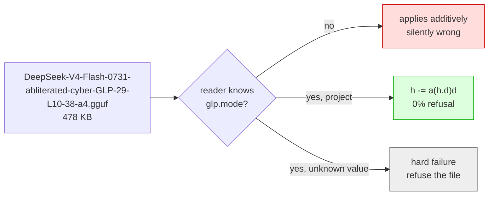

# GLP — GGUF Layer Projection: format and apply path

A **GLP vector** (GGUF Layer Projection — put your model on GLP and it comes
back weightless) is a few hundred KB of per-layer directions that change
a model's behaviour at inference time without touching its weights. This document
specifies the container we write, the one metadata key that makes it safe to
share, and the three reader implementations.

The motivating result: on `deepseek-ai/DeepSeek-V4-Flash-0731` a **478 KB** file
reproduces what a **157 GB** re-uploaded checkpoint achieves on our cyber suites.
Both reach 0% refusal. One of them you can attach to a review comment.

Naming: **GLP-n** marks a vector by coverage — the number of layers it
steers (GLP-29 for the DSV4 vector over L10–38, GLP-49 for the Qwen one over
L10–58). Coverage is the variable that dominates this intervention, so it is
the name.

## Why this needs a spec at all

llama.cpp has shipped control vectors since 2024 (`--control-vector`), with a
container convention we deliberately reuse: tensors named `direction.<N>`, fp32,
1-D, applied on the post-layer residual stream. We do not want a second format.

But llama.cpp's apply is:

```
h  <-  h + v                      ADD:      steer towards a direction
```

and what we measured is:

```
h  <-  h - alpha * (h . d) d      PROJECT:  delete the component along a direction
```

These are different operations, and the difference is not a scale factor.
Loading a projective direction into an additive consumer **raises no error and
produces wrong output**: instead of removing the refusal component it pushes
every token along the refusal axis. Nothing downstream detects this — the file
has the right tensor names, the right dtype, the right shapes.

So the operation has to travel with the data, and an unrecognised operation has
to be fatal. That is the whole reason for the extension:

```
glp.mode = "project" | "add"
```

Absent key means `add`, which is what every control vector written before this
key existed is. This is the one field a reader may not ignore.

**Renamed, not aliased.** Pre-2026-08-22 internal files used the `dspark.*`
namespace; the GLP rebrand renamed the keys to `glp.*` with no compatibility
alias (no external files existed). A file carrying only `dspark.*` keys is a
pre-GLP internal build: re-export or re-download rather than reading it.



### Naming, since the words are used interchangeably and shouldn't be

**Directional ablation** is the operation — remove the component along `d̂`. It has
two implementations, and Arditi et al. describe both: applied to activations at
inference, or folded into the matrices (they call the latter weight
orthogonalization).

**Abliteration** is the community name for the weight-baked form. In practice an
"abliterated" model on HuggingFace means edited weights in a redistributable
checkpoint.

This file carries the activation-space form. It performs the same operation
abliteration performs, at a different point in the computation, and ships no
weights — so calling it "abliterated" would set the wrong expectation.

The mode is named `project` rather than `ablate` for the same reason: `ablate`
would not tell a reader *which* implementation to apply, and the two are not
interchangeable at load time. That ambiguity is the failure this field exists to
prevent.

Worth knowing if you are comparing artifacts: a weight-space directional ablation
is `ΔW = −α·d̂(d̂ᵀW)`, an outer product, so it is **exactly a rank-1 LoRA**. A
projection on the *post-layer residual* is not expressible that way, because that
tensor is an accumulated sum — attention write plus FFN/MoE write plus carried
residual — with no single `W` behind it. That is the dividing line between the two
forms, and the reason a redistributable abliteration could be ~1.4 MB of rank-1
LoRA rather than a full checkpoint.

## Container

Standard GGUF v3. Tensor convention is llama.cpp's, unchanged:

| | |
|---|---|
| tensor names | `direction.<N>`, `N >= 1` — `direction.0` is invalid |
| dtype | `F32` |
| shape | 1-D, `n_embd`, identical across all tensors |
| layer mapping | **`direction.N` applies at layer `N`.** No offset. Layer 0 cannot be expressed. |

### The layer mapping, stated flatly because we got it wrong

The upstream code reads the other way, and this cost us a wrong exporter.
`common_control_vector_load_one()` stores `direction.N` at data offset
`(N-1)*n_embd`, which looks like "N-1 is the layer". But
`llama_adapter_cvec::apply()` then fills `tensors[il]` from offset
`(il-1)*n_embd`, so the two `-1`s cancel: `tensors[il]` holds `direction.il`, and
`apply_to()` uses it at graph layer `il`.

Confirmed by measurement rather than by reading it a third time —
`tests/test-cvec-layer-map.cpp` puts one direction in one slot and sweeps
single-layer `il_start`/`il_end` ranges to see which layer responds.
`direction.3` responds at layer 3 and nowhere else.

**An exporter with 0-based layer ids writes `direction.<id>` verbatim.** Our first
version wrote `<id>+1`, and no measurement of ours could have caught it: the vLLM
loader subtracted the same 1, so export and import cancelled and every run applied
the directions to the layers they were derived from. The measured results are
valid. What was broken was the file as an *interchange* format — llama.cpp would
have applied it one layer late across the whole stack.

That is exactly the class of bug this spec exists to prevent, so it is worth
saying why it survived: a one-layer shift **does not fail, it degrades**. Adjacent
layers' refusal directions have cosine similarity 0.555–0.979 (mean 0.863), so a
shifted stack
still ablates, still answers coherently, and still passes a smoke test. Only a
differential layer-mapping probe finds it.

If you are comparing against llama.cpp's own `cvector-generator`: it names the
difference measured at layer `il` as `direction.{il+1}` (`mean.hpp:18`,
`pca.hpp:305`), so upstream's generator and applier sit one layer apart. The
applier decides where a distributed file takes effect, so match the applier.

## Metadata

### Required

| key | type | meaning |
|---|---|---|
| `glp.mode` | string | `project` or `add`. **Fatal if unrecognised.** |
| `glp.spec_version` | uint32 | How to interpret the `glp.*` keys. Currently `1`. |

`glp.spec_version` is deliberately distinct from `general.version`:
`general.version` says *which build of this vector*, `spec_version` says *which
contract you are holding*. If `mode` gains a value or `alpha` changes meaning, a
reader needs to tell those apart. Conflating them is how a format rots.

### Apply parameters

| key | type | meaning |
|---|---|---|
| `glp.alpha_default` | float32 | Ablation strength. `1.0` removes the component exactly; we ship `4.0`. |
| `glp.rank` | uint32 | Directions per layer. `1` for everything we have measured. |
| `glp.orthonormal` | bool | Whether the per-layer basis is orthonormal. Required for rank > 1. |
| `glp.hook_point` | string | Where the projection is applied. See the table below. |
| `glp.derived_at` | string | Where the direction was *captured*. Absent means "same as `hook_point`". |

`alpha` is a **separate parameter, never folded into the vector**. Projection is
quadratic in the direction's norm — scaling `d` by `s` scales the removal by `s²`
— so a strength baked into the data would not mean what a caller expects. The
additive path folds strength into the data and is right to; the projective path
must not.

`hook_point` matters more than it looks. A vector is calibrated for one site,
and applying it at another degrades silently rather than failing — there is no
error to catch, only a weaker steer. (The one comparison on record, 34.0% vs
3.8% refusal, measured the *attention* write against the folded residual at
equal coverage — a real application-point result, routinely misquoted as
bounding every non-residual site. It says nothing about the FFN writer, which
has never been measured, and the 34.0% came from a retired scorer, so it
cannot be re-audited.) A reader whose hook does not match must refuse the file
rather than apply it somewhere else.

Recognised values:

| value | tensor | readers |
|---|---|---|
| `residual_stream_post_layer` | the accumulated residual after the layer's writes are folded in — llama.cpp's `build_cvec()` site, and the vLLM overlay's | vLLM, llama.cpp fork |
| `ffn_out_pre_residual` | the FFN/MoE write alone, before the residual (on DSpark, hyper-connection) fold | ds4 |
| `attn_out_pre_residual` | the attention write alone, before the same fold | ds4 |

The two `*_pre_residual` values were added for ds4, which steers the writers
rather than the folded residual: `ffn_out = moe + shared`, immediately before
`hc_post_one()`. They are **not** synonyms for `residual_stream_post_layer` and
a reader must not treat them as interchangeable — projecting a writer prevents
one layer's new deposit while the component accumulated upstream sails through
untouched, which is a weaker intervention by construction, at an alpha whose
meaning differs (at the residual, 1.0 removes the component exactly; at a
writer, 1.0 removes that write's component and >1 injects anti-signal per
layer).

The practical consequence is that a vector is calibrated for one site. A
producer targeting ds4 should export with the matching `hook_point` and an
`alpha_default` measured there; a consumer handed a vector for a different site
should refuse it, and if a caller overrides that refusal the alpha does not
carry over. Coverage still dominates strength either way, so the same layer
range is worth reusing across sites even when the alpha is not.

`derived_at` exists because `hook_point` alone conflates two things: where the
direction was derived and where it should be applied. For a natively derived
vector they coincide and `derived_at` may be omitted. The moment a vector is
transferred to another site — derived on the post-layer residual, applied at
the FFN write — they diverge, and without this key a consumer cannot
distinguish a transferred vector from a natively derived one. That is the same
un-checkable ambiguity this spec exists to eliminate. A reader still applies at
`hook_point` and refuses on a hook mismatch as before; `derived_at !=
hook_point` is a **warning, not a refusal**, and inspect tooling should surface
it. `alpha_default` belongs with the apply site, never the derivation site.

### Provenance

| key | type | meaning |
|---|---|---|
| `general.base_model.count` / `.0.name` / `.0.organization` / `.0.version` / `.0.repo_url` | | The base model, using GGUF's own convention. `.0.version` is the HF commit. |
| `glp.content_sha256` | string | SHA-256 over tensor bytes only. |
| `glp.created` | string | ISO date. |
| `glp.method` | string | e.g. `paired_difference_of_means`. |
| `glp.contrast` | string | e.g. `write_form_vs_explain_form_content_matched`. |
| `glp.layer_ids_zero_based` | string | Comma-separated, redundant with the tensor names but readable via `gguf_dump`. |

`created` makes the file non-reproducible — re-exporting identical vectors yields
different bytes — so `content_sha256` is what lets someone verify they hold the
same direction regardless of when it was packaged. The hash covers tensor bytes
only, not metadata, for that reason.

A direction is tied to the exact base checkpoint it was derived from. Applying
one to a different revision is undefined, hence the commit pin rather than just
a model name.

## Reader conformance

A conforming reader **must**:

1. Read `glp.mode`. Treat absence as `add`.
2. **Fail** on a value it does not implement. Never fall back to `add`.
3. **Fail** if `glp.hook_point` names a hook it does not apply at.
4. Reject `direction.0` and apply `direction.N` at layer `N`.
5. Not fold `alpha` into the data in `project` mode.
6. Refuse to merge a `project` file with any other control vector. Elementwise
   summing is meaningful for additive vectors only; two projections do not
   compose into a projection along the sum of their directions.

(6) is easy to miss because the existing loader sums across `--control-vector`
arguments unconditionally, and the sum of two unit directions is not a unit
direction.

## Apply, in graph ops

```
coef = mul_mat(d, h)                  # [n_embd] x [n_embd, n_tokens] -> [1, n_tokens]
proj = mul(repeat(d, h), coef)        # broadcast along embedding axis -> outer product
h    = sub(h, scale(proj, alpha))
```

`mul_mat` contracts over the embedding axis to give one coefficient per token;
`mul` with a `[1, n_tokens]` operand broadcasts the coefficient back along the
embedding axis, which is the rank-1 outer product.

`ggml_out_prod` would do that in a single op, and is the obvious choice, but
**Metal does not implement `GGML_OP_OUT_PROD`** — only CPU and CUDA do
(`ggml-cuda.cu:4969`). Using it would split the graph and fall back to CPU on
Apple silicon. The five-op form runs natively everywhere, at the cost of
materialising the `repeat` result.

Cost per steered layer: one GEMV reduction, one materialised `[n_embd, n_tokens]`
tensor from the `repeat`, and one elementwise pass — against a full layer's
attention and MoE matmuls. Measured on the 2×GB10 cluster: **no throughput
change**, 42-44 tok/s steered versus unsteered, and draft acceptance 2.81 versus
2.72 on an unsteered control (both inside the content-driven spread — acceptance
on this model ranges 2.4 to 5.6 purely by prompt shape).

## Implementations

**ds4** — `github.com/antirez/ds4`, `ds4_glp.c` / `ds4_glp.h`
([PR #970](https://github.com/antirez/ds4/pull/970)). A C reader with its own
GGUF v3 parse, feeding the dense layer-indexed direction buffer ds4's
`--dir-steering-file` already uses; `direction.N` lands at row `N` and
uncovered layers are zeroed, which is a no-op under this operation. ds4 arrived
at the projective op independently — its steering path was already
`y -= scale * v * dot(v, y)` — so what this adds is only the container: mode,
hook point, layer-map cross-check, base-model pin. It applies at
`ffn_out_pre_residual` (`--dir-steering-ffn`) or `attn_out_pre_residual`
(`--dir-steering-attn`), refuses a mismatch unless
`--dir-steering-allow-hook-mismatch` is passed, and does not implement
`residual_stream_post_layer`, so vectors published for the two readers below
need that override and a re-tuned scale. `--dir-steering-info FILE` is its
inspect path (the `test-cvec-inspect` equivalent). `dir-steering/tools/f32_to_glp.py`
is a stdlib-only producer for ds4's own raw vectors.

**vLLM (this repo)** —
`recipe/overlay/vllm/models/deepseek_v4/nvidia/model.py`. `_load_gguf_control_vector()`
reads the file; the apply is in the layer loop. Enabled with
`WEIGHTLESS_STEER_PATH=/path/to.gguf`, `WEIGHTLESS_STEER_ALPHA`, `WEIGHTLESS_STEER_LAYERS`.
The live deployment is the Anemll 0.1.1 (vLLM 0.25.2) stack, where the same
code is applied by `patches/hotfix-dsv4-steering-projective.py` as a boot
hotfix — that image has no `gguf` package, so the hotfix embeds a minimal
GGUF v3 reader and runs the identical spec checks (mode, hook point, layer
cross-check).

One implementation note that cost real time: the direction stack is a **dense
zero-padded tensor indexed by layer id**, and the op is applied
**unconditionally**, never inside a Python `if`. Anything under
`@support_torch_compile` runs its Python only at compile warmup, and vLLM's
compile cache key does not include these values. A Python `float` alpha gets
baked in as a graph constant (alpha=1/2/4 produced byte-identical output);
`alpha=0` traces a graph *without* the op and then caches it; a dict lookup
becomes a `KeyError` from a stale AOT artifact. All three failure modes look like
"steering does nothing" rather than an error.

**llama.cpp fork** — `github.com/msuiche/llama.cpp` (currently private), on top of the existing
control vector path:

| file | change |
|---|---|
| `include/llama.h` | `llama_cvec_apply_mode` enum; `llama_set_adapter_cvec_ex()` |
| `src/llama-adapter.cpp` | projective branch in `apply_to()`; norm check in `apply()` |
| `src/llama-adapter.h` | `mode`, `alpha` on `llama_adapter_cvec` |
| `src/llama-context.{h,cpp}` | plumb mode/alpha; old entry point wraps the new one as ADD/1.0 |
| `common/common.{h,cpp}` | read `glp.mode` / `alpha_default` / `hook_point` (legacy `dspark.*` alias accepted); refuse mixing |
| `tests/test-cvec-project.cpp` | op composition vs a hand-computed projection |
| `tests/test-cvec-model.cpp` | logit-level checks on a real model + loader refusals |
| `tests/test-cvec-layer-map.cpp` | pins `direction.N` → layer `N` by measurement |
| `tests/test-cvec-inspect.cpp` | reads a real vector, no model needed |

`test-cvec-inspect` is the tool to reach for first when a vector behaves oddly: it
prints mode, alpha, populated slots, resolved layer ids and per-direction norms
for any control vector without loading the model it belongs to. Our off-by-one
surfaced as it reporting layers 11–39 for a file derived from layers 10–38.

### The hook point is the same tensor, not just the same name

llama.cpp carries `LLM_ARCH_DEEPSEEK4` with DSpark tensors, and in
`src/models/deepseek4.cpp` the trunk reads:

```cpp
inpL = build_hc_post(cur, residual, post, comb, il);   // hyper-connection fold
inpL = build_cvec(inpL, il);
cb(inpL, "l_out", il);
```

`build_hc_post` is the same `MHCPostOp` folding our overlay applies
(`post_layer_mix * x + Σ comb_res_mix * residual`), and the control vector goes on
immediately after it. So `glp.hook_point=residual_stream_post_layer` names the
same tensor in both runtimes on this architecture — verified against the graph, not
inferred from the field name.

`deepseek4.cpp` calls `build_cvec` **twice**: once in the trunk and once in the MTP
(draft) block. The second one cannot currently fire. MTP layers are indexed
`il >= hparams.n_layer()` (`deepseek4.cpp:69`), while `llama_adapter_cvec::init()`
sizes `tensors` to `n_layer()`, so `tensor_for(il)` returns `nullptr` for every MTP
layer. That happens to match what we measured: our vLLM runs steer trunk layers
10–38 and leave the draft alone.

Worth flagging as a latent trap rather than a bug. Anyone extending the adapter to
`n_layer_all` would start steering the draft path, and draft acceptance is the
metric most easily broken and least visible — a silently degraded draft halves
decode throughput at unchanged output quality.

`llama_set_adapter_cvec()` keeps its signature and delegates with
`(ADD, 1.0)`, so existing callers and additive vectors are unaffected.
`--control-vector-scaled`'s strength becomes `alpha` for project-mode files
instead of a data multiplier.

## Producing one

`derivation/to_gguf.py <steer.pt> <out.gguf> [--alpha 4.0]` (in the
refusal-research repo) — writes the metadata
above, then reads the file back and asserts the round-trip: layer ids written
verbatim, fp32, 1-D, exact tensor equality, and that `mode` and `hook_point`
survived. It refuses layer 0 rather than emitting `direction.0`.

## Quantised base models

The file carries no weights, so it pairs with **any quantisation of the same
base checkpoint** at load time: `direction.N` matches on `n_embd` and layer
count, both of which quantisation preserves, and the apply runs in fp32 on the
residual stream regardless of the weight dtype. There is nothing on our side to
re-quantise — the direction tensors are a few hundred KB of F32 and must stay
that way. This holds for every GGUF layout in the community (unsloth,
lmstudio-community, ggml-org, per-layer mixed-precision allocations), not just
the checkpoints we ran.

Loadable is not the same as validated, and this part is **reasoning, not
measurement**. A direction is derived against one precision's activations, and
quantisation moves the residual stream it projects onto. Mean KL divergence
against the BF16 reference — the metric community quant comparisons already
publish per file — is a direct measure of that shift: reported numbers for
Qwen3.8-27B quants are ~0.001 at Q6_K-class and ~0.16 at IQ2-class (vendor
data, not ours). At high quants the drift is small and the direction should
transfer unchanged; at 2–3 bit it is large enough that α can under- or
over-shoot, and on Qwen3.8-27B α is behaviourally sharp — α=2 does not weaken
refusal, it *installs* it on benign prompts. No steering measurement of ours
has run on a quantised base. Treat pairing with anything below ~Q4 as needing
a re-run of the derivation suites, not as a given.

## Limits

- Directions are **checkpoint-specific**. No cross-model transfer is claimed.
- **Coverage dominates.** Layer count is the lever that moved our numbers:
  6 layers 18% → 16 layers 3.8% → 29 layers 0.0%. Alpha saturates above ~4 and
  rank-4 measured no better than rank-1, so a file with few layers will
  underperform regardless of how it was derived.
- Our direction is **domain-specific**: derived from a cyber write/explain
  contrast, it clears cyber suites completely but only partly transfers to an
  unrelated harmful-content suite. A general-purpose direction needs a general
  contrast set.
- `rank > 1` is expressible (`glp.rank`, `glp.orthonormal`) but neither
  reader implements it, and we have no evidence it helps.
